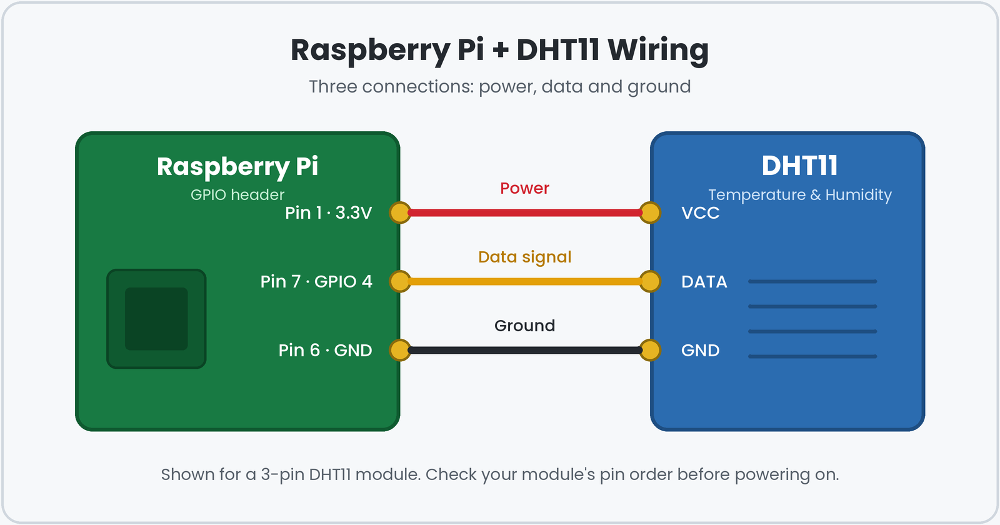

<h1 align="center">🍓 Raspberry Pi Sensor Projects</h1>

<p align="center">
  Real-time data collection and monitoring with Raspberry Pi, sensors and Python.
</p>  

<p align="center">
  
  
  
</p>

---

## 📖 Overview

This repository is a collection of small IoT projects built on a **Raspberry Pi**. Each project connects a sensor to the Pi, reads its data with **Python**, and shows it in real time. The goal is to practise **hardware–software integration** and real-time data handling, and to build a foundation for larger systems such as smart irrigation and environment monitoring.

## ✨ Features

- 📡 Reads sensor data continuously in real time
- 🌡️ Monitors environmental values such as temperature and humidity
- 🔌 Simple wiring with only three connections
- 🐍 Clean, beginner-friendly Python code
- 🧩 Easy to extend with more sensors

## 🧰 Hardware Required

| Component | Details |
|---|---|
| Raspberry Pi | Any model with a 40-pin GPIO header |
| DHT11 sensor | Temperature and humidity (3-pin module) |
| Jumper wires | 3 female-to-female wires |
| microSD card | With Raspberry Pi OS installed |
| Power supply | Official or compatible Pi adapter |

> **Note:** If you use the bare 4-pin DHT11 (not the 3-pin module), add a 10 kΩ resistor between the VCC and DATA pins.

## 🔌 Wiring

<p align="center">
  
</p>

| DHT11 Pin | Raspberry Pi Pin | Wire colour |
|---|---|---|
| VCC | Pin 1 (3.3V) | 🔴 Red |
| DATA | Pin 7 (GPIO 4) | 🟡 Yellow |
| GND | Pin 6 (GND) | ⚫ Black |

> ⚠️ Always switch the Pi off before changing any wiring.

## ⚙️ Getting Started

**1. Clone the repository**

```bash
git clone https://github.com/saniashaik5892-prog/raspberry-pi-sensor-projects.git
cd raspberry-pi-sensor-projects
```

**2. Create a virtual environment (recommended)**

```bash
python3 -m venv venv
source venv/bin/activate
```

**3. Install the dependencies**

```bash
pip install -r requirements.txt
```

**4. Run a project**

```bash
python3 projects/<script_name>.py
```

## 📟 Example Output

The script prints a new reading every few seconds. Your values will differ:

```text
Temperature: 27.0°C | Humidity: 62%
Temperature: 27.0°C | Humidity: 61%
Temperature: 28.0°C | Humidity: 61%
```

## 📁 Project Structure

```text
raspberry-pi-sensor-projects/
├── images/            # Wiring diagram and screenshots
├── projects/          # Sensor project scripts
├── .gitignore
├── requirements.txt   # Python dependencies
└── README.md
```

## 💡 What I Learned

- Connecting sensors to Raspberry Pi GPIO pins
- Reading and handling real-time sensor data in Python
- Debugging hardware and software problems together
- Structuring a project so others can reproduce it

## 🚀 Future Improvements

- [ ] Save readings to a CSV file for later analysis
- [ ] Add a live dashboard or chart
- [ ] Send alerts when values cross a threshold
- [ ] Add more sensors, such as soil moisture, for smart irrigation

## 👩‍💻 Author

**Shaik Sania**, B.Tech CSE (IoT) student at VVIT
🔗 GitHub: [@saniashaik5892-prog](https://github.com/saniashaik5892-prog)

---

<p align="center"><i>If you find this useful, please give it a ⭐</i></p>
